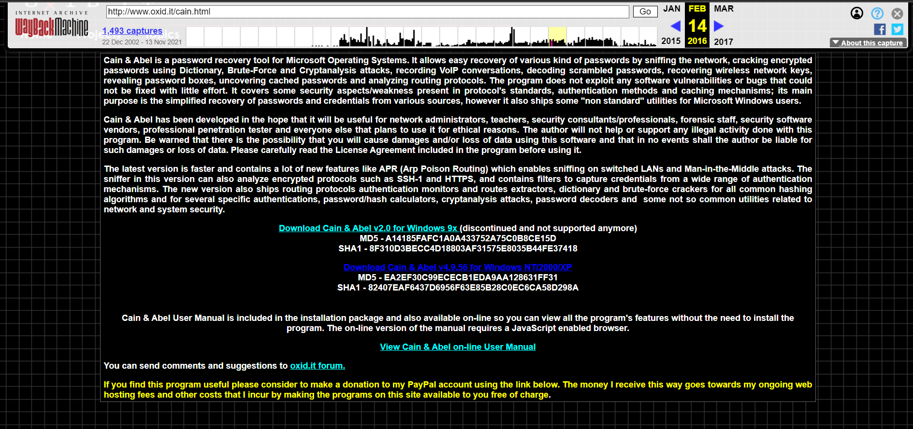

# Decryption

## Photos
|  |  |
| ----------------------- | ------------------- |
## Group Members
 - Aaron Wageman
 - Justin Hirner
 - Precious Shittu

## Subtopics
 - Spotting weak passwords 
 - Simple Crack
 - GUI alternatives


## Tools Used
 - John The Ripper
 - Tutorial guide for John The Ripper: https://www.varonis.com/blog/john-the-ripper/
 - John The Ripper command docs: https://www.openwall.com/john/doc/OPTIONS.shtml
 - John The Ripper modes docs: https://www.openwall.com/john/doc/MODES.shtml
 - Hashsuite
 - Cain and Abel
 - Virtual Box
 - Tutorial for installing Cain and Abel: https://www.youtube.com/watch?v=Y2fhWtZedTQ
 - Tutorial for hashsuite: https://hashsuite.openwall.net/tutorial
 - Microsoft windows virtual box link: https://developer.microsoft.com/en-us/windows/downloads/virtual-machines/


# How to Install and run John the Ripper
 - To start, go to the John the Ripper website. You can either Google "John the Ripper password cracker" or you can choose to follow this link: https://www.openwall.com/john/
 - Once there, download the binary file for your bit OS. We chose the installation of the 64-bit version. 
 - Once installed, find the zip file and extract it to a folder for which you want to keep it. 
 - Now, open the folder that you extracted the contents to, and open the "run" folder. 
 - Open your "Git Bash here" command, and run the command "./john"
 - Now you should have full access to the program


# Spotting Weak Passwords (Aaron Wageman)

## Sources Used
 - John The Ripper
 - Tutorial guide for John The Ripper: https://www.varonis.com/blog/john-the-ripper/
 - John The Ripper command docs: https://www.openwall.com/john/doc/OPTIONS.shtml
 - John The Ripper modes docs: https://www.openwall.com/john/doc/MODES.shtml
 - Top 100 worst passwords for the wordlist: https://www.forbes.com/sites/daveywinder/2019/12/14/ranked-the-worlds-100-worst-passwords/?sh=75aa22d069b4
 - John The Ripper Pen Testing: https://www.csoonline.com/article/3564153/john-the-ripper-explained-an-essential-password-cracker-for-your-hacker-toolkit.html

## Prerequisites
- Windows, Linux, or MacOS

## Overview
John The Ripper can be used as a tool in IT. John The Ripper's password cracker allows for companies to see if their employees are following good password practices.
John the ripper has 3 modes:
  - single crack 
  - wordlist
  - incremental

Single crack mode cracks password hashes by using login names, "GECOS", and the users home directory names. Wordlist mode allows the user to try and break the password with a list of popular passwords such as "password". John the ripper takes the words from the wordlist and makes them into hashes. Then these hashes are compared to the hashes supplied in the password file given by the user. Lastly, is the incremental which is a brute-force password cracker. There are some issues with the incremental mode. The incremental mode can take long amounts of time and can sometimes never end if the password is too strong (which is good for the password).

## Penetration Testing
John The Ripper is also an effective tool used in pen testing. Using the simple crack mode allows for all three modes to be used. This allows for passwords to be tested for security purposes. If an employees password is cracked then the system is vunerable. Pen testing is essential to help secure systems and find vulnerabilities.

### Code and Processes

Using the wordlist method:
1. Download the mynewwordlist.txt and newpassworddoc.txt from our github
2. Use git bash here in the "run" folder (See How to install above)
3. Run the command: ./john newpassworddoc.txt -wordlist="mynewwordlist.txt" --format=Raw-SHA256
4. Then run ./john --show --format=Raw-SHA256 newpassworddoc.txt


### Note from Justin
When making your own passwords to crack, make sure that you do not create the files inside Git Bash, as for some weird reason, it will not crack the password. Even if the password is most definitely in the wordlist, it will not crack it. Simply, to get by this just create each of the files inside windows explorer, and only copy the hash value from Git Bash and then paste it into a text or log file. Then you should be able to run the decryption with no hitches.

# Simple Crack (Justin Hirner)
When attempting to crack a password from a given hash, JTR has a built-in feature called "Simple Crack", that will figure out the password by using the built-in wordlist or dictionary. This is a long process as the program does not know the length or which characters are used in the password. I will provide an example of a simple crack in class, but show the result as it could take hours at most. 

To start a simple crack just enter the following code into your Bash terminal:

```
./john --single "passwordfilename" /*with file extension at end*/
./john --incremental "passwordfilename"
```

This is the simplest way of cracking a password from a given hash, however, it is the longest.

However, if you wish to take the "simple crack" a step further, if you ***know*** the hash of the password, and put it into a text file, you can enter the following code to assist John in finding the password.

Side note: I personally could not get --single to work at all and it would only leave me with "0 password hashes cracked, 1 left" and I couldn't ever get it to work even with assistance from the official JtR website.
So as an example, if we ***know*** that the password is a sha256 hash, we can enter this:
```
./john --incremental --format=Raw-SHA256
```
Here is a picture of it working, as the process could take a while.


If you wish to find out what kind of hash the password is, JtR has a method of "suggesting" what type it is. 
Here is an example of that with sha256.


# GUI alternatives(Precious Shittu)
the two main programs i will be talking about in this section are Hashsuite and cain.
## Intallations
I had to go through virtual box because the laptop's anti virus won't let men install either programs. we will be talking about hashsuit first because it was the only one i actually got to work. the first step is to go to this site and get the free version: https://hashsuite.openwall.net/download. It is relatively simple from here on out, you just have to extract the zip and with that you should have hash suite intalled on your system.


Cain wasn't as smooth to install. in the first place the website where it can be downloaded doesn't exist anymore so i had to go through the wayback machine to acess the website. heres the link: https://web.archive.org/web/20160214132154/http://www.oxid.it/cain.html.
 
after that click on Download Cain & Abel v4.9.56 for Windows NT/2000/XP to download the installer.
Next we will also need to install something called WinPcap you can get that from here: https://www.winpcap.org/install/default.htm.  click Version 4.1.3 Installer for Windows to download the installer. install WinPcap first, the installation for wincap is fairly straight forward.


I got an error when trying to install the packet driver, this seems to prevent me from importing lists


## running Simple Crack with hashsuite
### Hashsuite
for this demo i tried downloading word lists from the downloader tab in hashsuite but it didn't seem to work properly when i imported them so i just went with one of the sample hashes that came with the hashsuit folder. this can be found under the samples folder. once the hashes are imported from the file

click on start after you set the rules you want for the testing and it will start trying to crack the hashes.

### Cain


### Summary/Final Thoughts
We just covered how to use the John The Ripper password cracker. Specifically, the wordlist mode. This can be used in a variety of settings such as, forensics or IT. Wordlist could be utilized to crack passwords during investigations or to test the strength of employee's passwords to prevent leaks.


